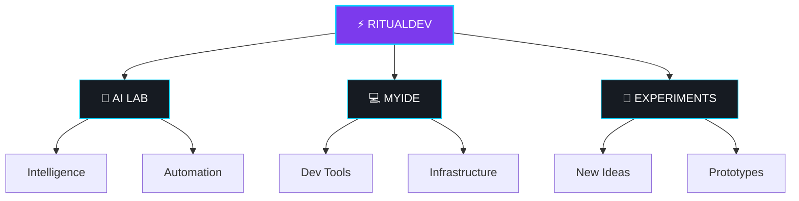
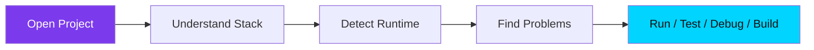
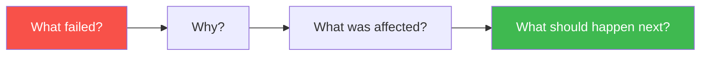

<div align="center">

<!-- Layer 1: continuously-twinkling strip (never settles into a still frame) -->


<!-- Layer 2: looping typing wordmark — this is the actual title, and it's always mid-animation -->


<!-- Layer 3: waving crest, motion never stops -->


<a href="https://ritualdev.in"></a>
<a href="https://github.com/Ritual-Dev-Git"></a>
<a href="https://www.reddit.com/r/MyIDE/"></a>


<br/><br/>

<!-- CTA row: the "clickable-feeling" items — a demo link, trophies, and a feedback badge -->
<a href="https://ritualdev.in/demo"></a>
<a href="https://github.com/Ritual-Dev-Git/Ritual-Dev-Git/discussions/new?category=general"></a>

<br/><br/>

<a href="https://github.com/ryo-ma/github-profile-trophy"></a>

</div>


## 🧬 RitualDev

**RitualDev** is a software and experimentation lab exploring developer tools, AI, automation, infrastructure, and new software ideas.

<div align="center">

</div>




## 🚀 Currently Building

### 💻 MyIDE — *A developer workspace that understands the project around your code.*

MyIDE is a **local-first developer IDE**, beginning with a strong focus on JavaScript and TypeScript development.

<table align="center">
<tr>
<td align="center">

**The old way**

```
Open Files → Edit Code
```

</td>
<td align="center">⚡</td>
<td align="center">

**The MyIDE way**



</td>
</tr>
</table>

> 💡 **Open a project and let the IDE understand what it is, what it needs, what's running, what's broken, and what should happen next.**

<details>
<summary><b>⚡ What MyIDE Is Exploring — click to expand</b></summary>
<br/>

| | Area | Goal |
|---|---|---|
| 💻 | Editor | JS / TS / JSX / TSX |
| 🧠 | Project Intelligence | Understand the whole project |
| 🖥️ | Terminal | Real terminal and process execution |
| ⚙️ | Dev Sessions | Manage multiple project services |
| 🧪 | Testing | Real test-runner integration |
| 🐞 | Debugging | Breakpoints, stacks and variables |
| 🔨 | Builds | Real build-system execution |
| 🌿 | Git | Repository workflows |
| 🌐 | APIs | HTTP development |
| 🗄️ | Databases | Connections, queries and schemas |
| 🐳 | Containers | Docker-based development |
| 📦 | Monorepos | Workspace intelligence |
| 🔐 | Security | Trust, isolation and secrets |
| 🤖 | AI | Grounded developer assistance |

</details>


## 📊 Terminal Stats & Analytics 

<div align="center"> 
  <!-- GitHub Stats Terminal Style --> 
  <a href="https://github.com/Ritual-Dev-Git"> 
     
  </a> 
</div> 

<br/> 

<div align="center"> 
  <!-- Official GitHub Readme Stats --> 
   
  <!-- Official Streak Stats --> 
   
</div> 

<br/> 

<div align="center"> 
  <!-- Official Top Languages --> 
   
</div>


## 🖥️ Development Sessions

<table align="center">
<tr>
<td align="center" valign="top">

**Before**
```
Terminal 1 → Frontend
Terminal 2 → Backend
Terminal 3 → Worker
Terminal 4 → Database
Terminal 5 → Electron
```

</td>
<td align="center">➡️</td>
<td align="center" valign="top">

**After**
```
🟢 Database      Connected
🟢 API           :4000
🟢 Frontend      :3000
🔴 Worker        Failed
🟡 Electron      Waiting
```

</td>
</tr>
</table>




## 🧠 RitualDev Principles

<div align="center">

| ⚖️ | Principle |
|---|---|
| ✅ | **REAL** > Broad |
| ✅ | **VERIFIED** > Claimed |
| ✅ | **SECURE** > Convenient |
| ✅ | **RELIABLE** > Feature-rich |
| ✅ | **WORKFLOW** > Feature count |
| ✅ | **BUILD** > Talk |

</div>


## 🛠️ Technologies We Explore

<div align="center">

**Languages**
<br/>


**Web**
<br/>


**Backend & Desktop**
<br/>


**Infrastructure**
<br/>


**Tooling**
<br/>


</div>


## 🧪 RitualDev Lab

<div align="center">

`🤖 AI Agents` • `🧠 Developer Intelligence` • `💻 IDE Architecture` • `⚡ JS/TS` • `🖥 Desktop Apps` • `🌐 Web Apps` • `🧰 Dev Tools` • `🐳 Dev Infrastructure` • `🔐 Security` • `🧩 Extensible Systems` • `🧪 Experimental Software` • `🌍 Open Source`

</div>

## 🌱 Right Now

```yaml
🔨 Building:      MyIDE
🤖 Exploring:     AI Agents
🧠 Researching:   AI × Developer Tools
🧪 Experimenting: New software ideas
🌐 Building:      RitualDev.in
🚀 Shipping:      Projects
```

<div align="center">


</div>

> 🕒 *This badge refreshes on its own every few minutes — it's pulling the real clock, not a fixed screenshot.*

### 💬 Quote of the Moment

<div align="center">

<a href="https://github.com/zhravan/github-readme-quotes"></a>

</div>


## 📊 GitHub Activity

<div align="center">


</div>

## 📈 Contribution Activity

<div align="center">


</div>

## 🐍 Contribution Snake

<div align="center">


*If the snake does not appear yet, the `output` branch must first be generated by the GitHub Action.*

</div>

## 🧊 3D Contribution Calendar

<div align="center">


*Generated by [yoshi389111/github-profile-3d-contrib](https://github.com/yoshi389111/github-profile-3d-contrib) — a rotating isometric read of the same graph above. Needs its own workflow file (see `AUTOMATION-SETUP.md`).*

</div>


## 🤝 Build With Us

We're interested in people who enjoy:

`JavaScript` • `TypeScript` • `Node.js` • `Electron` • `Developer Tools` • `IDE Architecture` • `Open Source` • `AI` • `Automation` • `Infrastructure` • `UI/UX` • `Security` • `Testing` • `Performance`

You don't need to agree with every idea.

**Good criticism is useful. Better ideas are welcome.**


## 💬 One Question

<div align="center">

### What makes you leave your IDE most often while developing?

*Terminal? Docker? Databases? APIs? Browser DevTools? Deployment?*

**That's one of the questions behind MyIDE.**

</div>

<br/>


